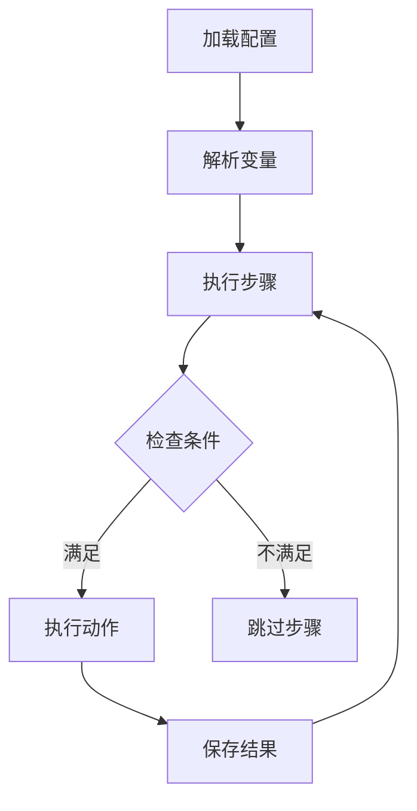
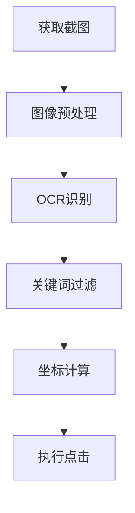
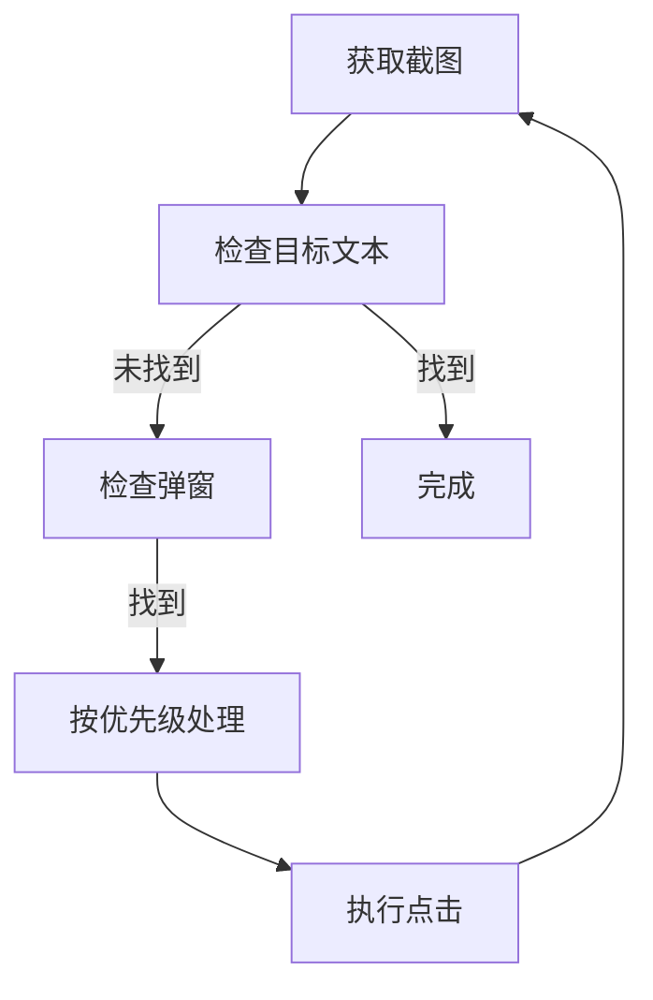

# RPA Framework 架构设计

## 整体架构

### 核心组件

1. BaseBot
   - 流程解析和执行
   - 变量管理
   - 条件判断
   - 步骤依赖
   - 调试支持

2. 工具类
   - AppHelper: 应用管理
   - OCRHelper: 文字识别
   - ScreenshotHelper: 截图处理
   - Logger: 日志管理

3. 动作实现
   - OCRActions: OCR相关动作
     - wait_and_click_ocr_text
     - handle_popups_until_target
   - 其他动作类型（待扩展）

### 目录结构
```
rpa/
├── core/           # 核心功能
│   ├── actions/    # 动作实现
│   │   └── ocr_actions.py  # OCR相关动作
│   ├── base_bot.py # 基础机器人
│   └── decorators.py # 功能装饰器
├── utils/          # 工具类
│   ├── app_helper.py  # 应用管理
│   ├── ocr_helper.py  # OCR支持
│   ├── screenshot.py  # 截图处理
│   └── logger.py      # 日志工具
└── assets/         # 内置资源
```

## 核心流程

### 1. 流程执行


### 2. OCR处理流程


### 3. 弹窗处理流程


## 关键机制

### 1. 坐标处理
- 图像缩放（默认0.5倍）
- 区域截图支持
- 坐标转换和校准
- 屏幕边界检查

### 2. 调试支持
- 调试目录结构
```
debug/
└── {timestamp}/
    └── {step_name}/
        ├── step_config.yaml    # 步骤配置
        ├── screenshot.png      # 原始截图
        ├── annotated.png      # 标注后的截图
        └── ocr_results.yaml   # OCR结果
```

### 3. 错误处理
- 动作重试机制
- 详细的错误日志
- 异常状态恢复
- 超时控制

### 4. 性能优化
- 图像预处理
  - 灰度转换
  - JPEG压缩
  - 区域截图
- OCR优化
  - 关键词过滤
  - 多进程支持
  - 批处理优化

## 扩展机制

### 1. 新增动作
1. 在actions/目录下创建新的动作类
2. 在BaseBot中注册动作类型
3. 更新flow_schema.md文档

### 2. 工具扩展
1. 在utils/目录下添加新的工具类
2. 在相关动作类中使用新工具
3. 更新API文档

### 3. 调试增强
1. 扩展_save_debug_info方法
2. 添加新的可视化支持
3. 增加更多调试信息
