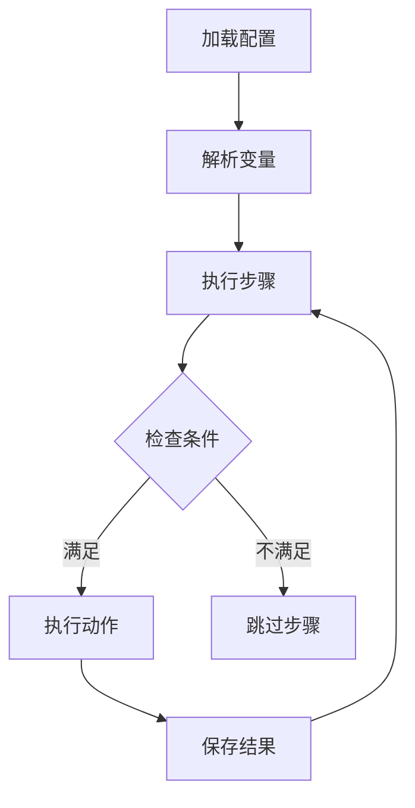
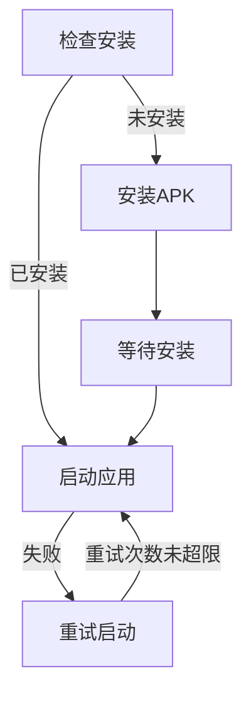

# RPA Framework 架构设计

## 整体架构

### 核心组件
1. BaseBot
   - 流程解析和执行
   - 变量管理
   - 条件判断
   - 步骤依赖

2. 工具类
   - AppHelper: 应用管理
   - OCRHelper: 文字识别
   - ScreenshotHelper: 截图处理
   - Logger: 日志管理

3. 动作实现
   - OCRActions: OCR相关动作
   - 其他动作类型（待扩展）

### 目录结构
```
rpa/
├── core/           # 核心功能
│   ├── actions/    # 动作实现
│   ├── base_bot.py # 基础机器人
│   └── decorators.py # 功能装饰器
└── utils/          # 工具类
    ├── app_helper.py  # 应用管理
    ├── ocr_helper.py  # OCR支持
    └── screenshot.py  # 截图处理
```

## 核心流程

### 1. 流程执行


### 2. 应用管理


## 关键机制

### 1. 变量解析
- 环境变量
- 步骤结果引用
- 配置变量

### 2. 条件判断
- 步骤结果条件
- 自定义条件（待扩展）

### 3. 错误处理
- 动作重试
- 异常恢复
- 错误日志

### 4. 调试支持
- 调试目录结构
- 日志分级
- 结果可视化
