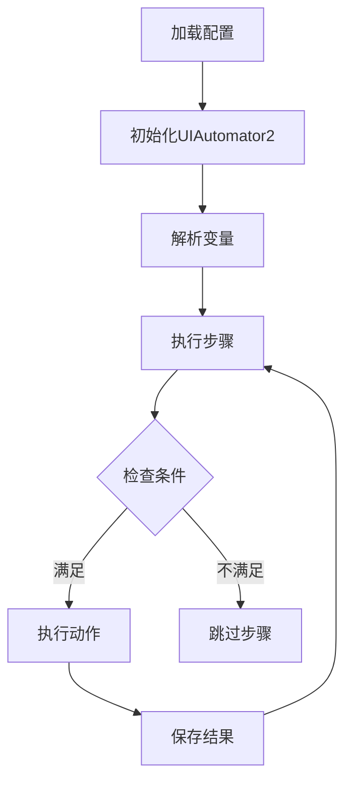
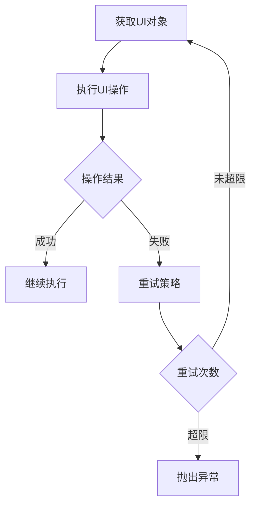
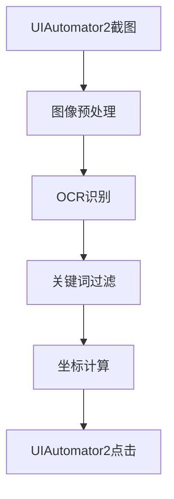

# RPA Framework 架构设计

## 整体架构

### 核心组件

1. BaseBot
   - 流程解析和执行
   - 变量管理
   - 动作调度
   - UI自动化控制
   - 调试支持

2. 动作系统
   - BaseAction: 动作基类
   - UI动作: 基于UIAutomator2的界面操作
   - OCR动作: 文字识别和智能点击
   - 数据动作: 数据处理和变量操作
   - 流程动作: 循环和条件控制
   - 应用动作: 应用生命周期管理

3. 工具类
   - AppHelper: 基于UIAutomator2的应用管理
   - OCRHelper: 基于PaddleOCR的文字识别
   - ScreenshotHelper: 基于UIAutomator2的截图处理
   - NetworkMonitor: 网络状态监控
   - LogcatMonitor: 日志监控
   - Logger: 日志管理

### 目录结构
```
rpa/
├── core/           
│   ├── actions/    # 动作实现
│   │   ├── __init__.py    # 动作注册
│   │   ├── base_action.py # 动作基类
│   │   ├── ui_actions.py  # UI动作(UIAutomator2)
│   │   ├── ocr_actions.py # OCR动作
│   │   ├── data_actions.py # 数据动作
│   │   ├── flow_actions.py # 流程动作
│   │   └── app_actions.py  # 应用动作
│   └── base_bot.py # 基础机器人
├── utils/          
│   ├── app_helper.py  # 应用管理
│   ├── ocr_helper.py  # OCR支持
│   ├── screenshot.py  # 截图处理
│   ├── network_monitor.py # 网络监控
│   ├── logcat_monitor.py # 日志监控
│   └── logger.py      # 日志工具
└── assets/         # 内置资源
```

## 核心流程

### 1. 流程执行


### 2. UI自动化流程


### 3. OCR处理流程


## 组件交互

### 1. UI自动化
- BaseBot持有UIAutomator2设备实例
- UI动作通过设备实例执行操作
- ScreenshotHelper使用设备截图能力
- AppHelper管理应用生命周期

### 2. OCR集成
- OCRHelper处理文字识别
- OCR动作结合UI自动化执行点击
- 支持UIAutomator2截图输入
- 智能等待和重试机制

### 3. 监控系统
- NetworkMonitor监控网络状态
- LogcatMonitor采集应用日志
- 支持异常检测和恢复
- 提供调试信息收集

## 扩展机制

### 1. 动作扩展
- 继承BaseAction实现新动作
- 在ACTION_MAP中注册
- 支持动作组合
- 可扩展动作参数

### 2. 工具扩展
- 实现自定义Helper类
- 注入到BaseBot
- 提供标准接口
- 支持调试集成

### 3. 监控扩展
- 自定义Monitor类
- 实现标准监控接口
- 集成到调试系统
- 支持数据收集

## 调试支持

### 1. 日志系统
- 详细的执行日志
- 动作执行记录
- 异常堆栈跟踪
- 性能统计信息

### 2. 可视化调试
- 截图标注
- OCR结果展示
- 点击位置显示
- 状态变化记录

### 3. 监控数据
- 网络请求记录
- 应用日志采集
- 性能指标统计
- 异常信息汇总
